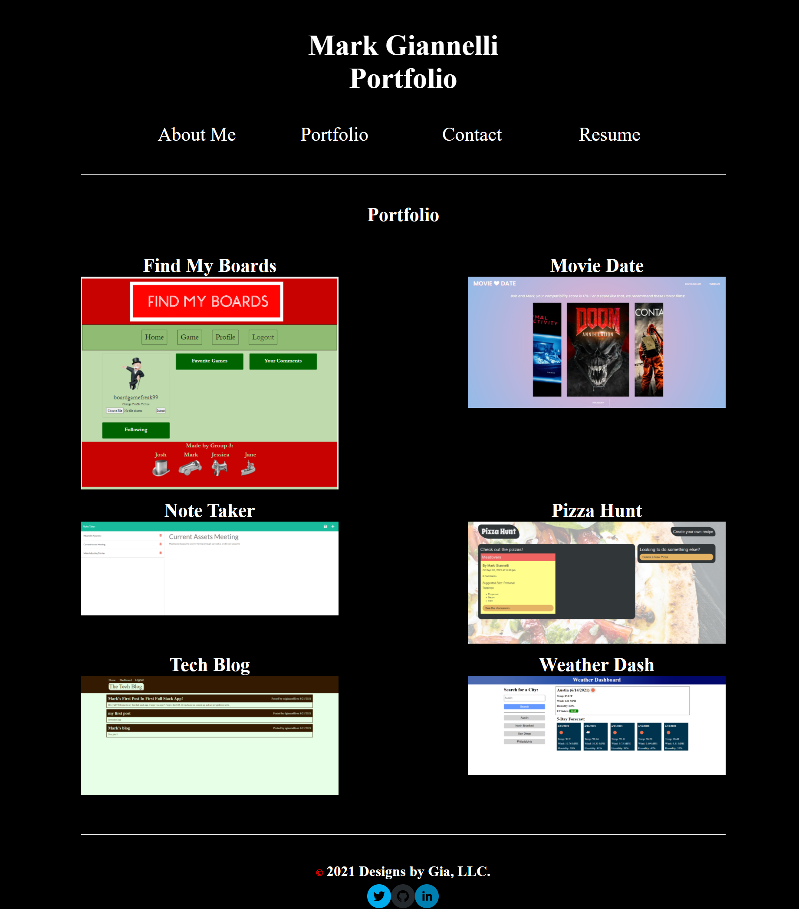

# React Portfolio
  
   

  ## Table-of-Contents

  * [Description](#description)
  * [Installation](#installation)
  * [Usage](#usage)
   
  * [Contributing](#contributing)
  * [Tests](#tests)
  * [Questions](#questions)
  
  ## [Description](#table-of-contents)

  My project is creating my portfolio with my new found React skills! This portfolio will help me separate myself from the competition and land interviews when applying for jobs.

  I created this project to display my work to potential employers in order to land a job at their company.

  A hiring manager will visit my porfolio, view my projects and determine if I have the skills necessary to land the job at their company. They will also be able to contact me and download my resume.

  ## [Installation](#table-of-contents)

  No need to install anything! Just visit my portfolio at the deployed link in the Usage section!

  ## [Usage](#table-of-contents)

  To use my website please click the following link:

  [www.markgiannelli.com](https://www.markgiannelli.com)

  

  ## [Contributing](#table-of-contents)
  
  
  Thank you for your interest in helping out; however, I will not be accepting contributions from third parties.
    

  ## [Tests](#table-of-contents)

  Nothing to test! just go to the deployed link under usage and view my projects!

  ## [Questions](#table-of-contents)

  Please contact me using the following links:

  [GitHub](https://github.com/mjgiannelli)

  [Email: giannellimj@gmail.com](mailto:giannellimj@gmail.com)
